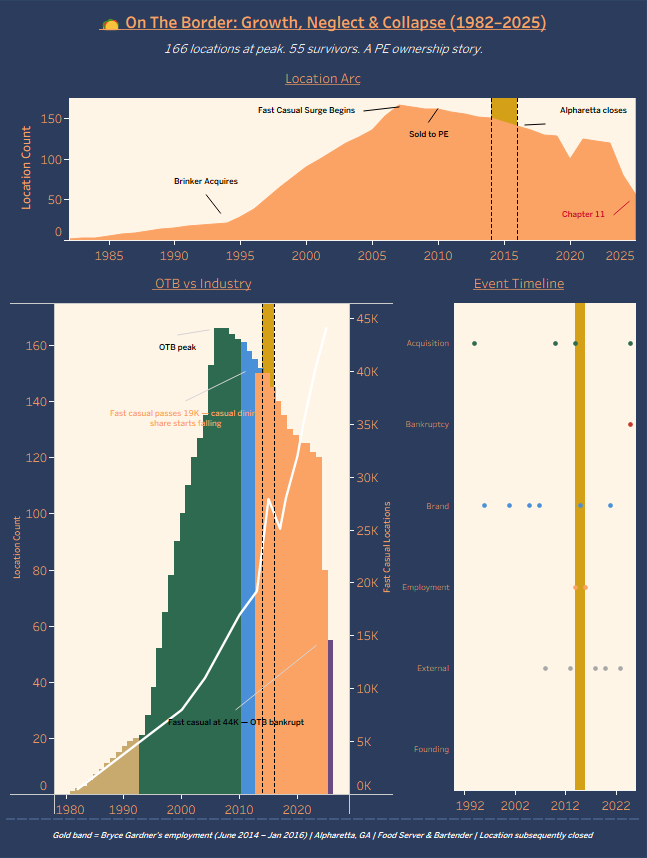

# 🌮 On The Border: Growth, Neglect & Collapse (1982–2025)
### Business Analysis Series — Project 2 of 3 | Tools: Python · SQLite · Tableau

A business analyst's deep dive into the full lifecycle of On The Border Mexican Grill & Cantina — from a single Dallas cantina in 1982 to a peak of 166 locations under Brinker International, through two private equity sales, and finally to a Chapter 11 bankruptcy filing in 2025 that left just 55 locations standing. This project examines how a solid regional brand gets hollowed out by ownership transitions, cost-cutting, and an industry headwind it never had the capital or leadership stability to fight.

**Personal note:** I worked at the Alpharetta, GA location from June 2014 to January 2016 as a Food Server & Bartender. Argonne Capital had acquired the brand just months before I started. The operational reality was exactly what PE ownership produces: chronic FOH understaffing, the tortilla station rarely staffed despite being a signature brand promise, and a relentless push on cheap high-margin promotions like the $3 "Meltdown" margarita. The Alpharetta location has since closed. This project is my attempt to understand, with data, whether what I experienced on the floor was a local management problem — or a systemic one. It was systemic.

---

## Tools Used
| Tool | Purpose |
|---|---|
| Python (pandas) | Data collection, cleaning, interpolation |
| SQLite | Database storage and structured querying |
| DB Browser for SQLite | SQL query interface |
| Tableau Public | Interactive dashboard and visualizations |
| Technomic Ignite | Industry location and sales data |
| SEC EDGAR / Press Releases | Acquisition and ownership data |
| Wikipedia / Restaurant Dive | Historical location counts and brand milestones |
| NPD Group / NRA | Fast casual industry growth data |

---

## The Story

### The Question
On The Border was never a bad restaurant concept. Tex-Mex is a durable category, the brand had real identity, and under Brinker International it grew steadily from 21 locations to a peak of 166. So why does it end in bankruptcy court in 2025 with 55 survivors?

The answer isn't the food. It's the ownership carousel.

Three PE transactions in 15 years — Brinker selling to Golden Gate Capital in 2010, Golden Gate selling to Argonne Capital in 2014, and Argonne running it into Chapter 11 in 2025 — produced exactly what PE ownership of casual dining always produces: labor cuts, deferred investment, cheap promotional pricing, and a brand that slowly stops being what it promised to be. Meanwhile fast casual grew from 8,000 US locations in 2000 to 44,000 by 2025, eating OTB's core customer one $12 burrito bowl at a time.

**The Alpharetta closure wasn't an accident. It was a data point.**

---

## Data Sources & Methodology

On The Border was privately held for the majority of its existence, which means no SEC filings and no public financials. This project uses location count as the primary metric — the most reliable publicly available indicator of brand health for a private casual dining chain.

Confirmed location counts were sourced from Brinker International annual reports, press releases, Technomic Ignite industry data, and bankruptcy filings. Years with no available data were filled using **linear interpolation between confirmed anchor points**, flagged with a `data_quality` column value of `'estimated'`. Fast casual industry growth data was sourced from NPD Group ReCount surveys and Technomic Top 500 reports.

---

## Database Structure

Four tables, built in SQLite:

| Table | Description |
|-------|-------------|
| `otb_locations` | Location count by year (1982–2025) with ownership era and data quality flags |
| `industry_context` | Fast casual, Chipotle, and Chili's location counts (1982–2025) |
| `key_events` | 19 annotated brand events — acquisitions, bankruptcies, brand milestones, external pressures |
| `bryce_employment` | Personal employment record — Alpharetta, GA location |

---

## SQL Highlights

**Location count by ownership era:**
```sql
SELECT ownership_era,
       COUNT(*) as years,
       MIN(location_count) as min_locations,
       MAX(location_count) as max_locations,
       ROUND(AVG(location_count), 1) as avg_locations
FROM otb_locations
GROUP BY ownership_era
ORDER BY MIN(year);
```

**Peak to bankruptcy decline:**
```sql
SELECT year, location_count,
       ROUND((location_count - 166.0) / 166.0 * 100, 1) AS pct_change_from_peak
FROM otb_locations
WHERE year >= 2007
ORDER BY year;
```

**Fast casual growth vs OTB decline:**
```sql
SELECT i.year,
       o.location_count AS otb_locations,
       i.fast_casual_locations,
       ROUND(CAST(i.fast_casual_locations AS REAL) / o.location_count, 1) AS fast_casual_per_otb
FROM industry_context i
JOIN otb_locations o ON i.year = o.year
WHERE i.year >= 2000
ORDER BY i.year;
```

**Events during employment window:**
```sql
SELECT year, event_label, event_type
FROM key_events
WHERE year BETWEEN 2014 AND 2016
ORDER BY year;
```

---

## Dashboard — Growth, Neglect & Collapse (1982–2025)

*166 locations at peak. 55 survivors. A PE ownership story.*

[](https://public.tableau.com/app/profile/bryce.gardner/viz/OTB_17811355993100/OnTheBorderGrowthNeglectCollapse19822025)

Three charts tell the OTB story together:

**Location Arc** traces the full location count journey from 1 Dallas cantina in 1982 to the 166-location peak in 2007, the slow PE-era bleed, the COVID cliff, and the final collapse to 55 survivors in 2025. The gold band marks the Alpharetta employment window. The shape of the area chart tells the whole story without a single number.

**OTB vs Industry** is the strategic context chart. OTB's location count bars are colored by ownership era — the Brinker growth era in forest green, the Golden Gate plateau in steel blue, the Argonne decline in orange, and the Pappas survival stub in purple. The white fast casual line climbs relentlessly from left to right. The crossover where the fast casual line begins its steepest climb while OTB's bars peak and begin falling — right at 2007–2008 — is the visual thesis of the entire project.

**Event Timeline** maps 19 key events across six categories as a dot plot, showing the acquisition binge that changed ownership three times in 15 years, the external industry pressures that accelerated the decline, and the two personal employment events that place Bryce's experience inside the corporate timeline.

---

## Key Findings

- **The PE playbook destroyed the brand promise.** OTB's identity was built on fresh tortillas, handcrafted margaritas, and a lively cantina atmosphere. PE ownership optimized for margin, not brand. Chronic understaffing, deferred kitchen investment, and cheap promotional pricing ($3 Meltdown margaritas) eroded the very things that made OTB worth visiting over a fast casual competitor.

- **The Alpharetta closure was not an anomaly.** Between peak (166 locations, 2007) and bankruptcy (55 locations, 2025), OTB closed 111 locations — a 67% reduction. Suburban markets with high fast casual competition were the first to go. Alpharetta, GA fits that profile exactly.

- **Fast casual didn't just compete with OTB — it replaced it.** Fast casual US locations grew from 8,000 in 2000 to 44,000 by 2025 — a 450% increase over the same period OTB declined by 67%. Chipotle alone grew from ~500 locations in 2004 to 3,700+ by 2025. OTB's core value proposition — affordable, flavorful Tex-Mex in a casual setting — was undercut by faster, cheaper, and fresher competition.

- **Three ownership changes in 15 years is a brand death sentence.** Brinker sold in 2010, Golden Gate sold in 2014, Argonne filed bankruptcy in 2025. Each transition reset strategic priorities, disrupted operational continuity, and prioritized near-term financial engineering over long-term brand investment. No restaurant brand survives that cycle intact.

- **COVID was the accelerant, not the cause.** OTB was already struggling before 2020 — sales had fallen more than 36% from 2006 to 2018. COVID accelerated closures that were already economically inevitable. The post-COVID rebound to 125 locations in 2021 was a false signal; by 2024 rapid pre-bankruptcy closures brought the count below 80.

---

## What I Learned (As an Analyst)

Working at the Alpharetta OTB during the Argonne acquisition, I experienced firsthand what happens when a brand optimizes for short-term margin at the expense of its core promise. The tortilla station being unstaffed wasn't a staffing oversight — it was a labor cost decision. The $3 Meltdown margarita push wasn't a creative marketing campaign — it was a traffic driver that sacrificed average check size. Every operational frustration I experienced on the floor was a PE financial decision made in a boardroom.

This project taught me that **brand erosion is a choice, not a circumstance.** The fast casual headwind was real and industry-wide, but Chili's — facing the same competitive environment — survived and is currently experiencing a genuine resurgence. The difference wasn't the category. It was ownership quality and investment discipline.

---

## Files in This Repository

| File | Description |
|------|-------------|
| `otb_analysis.db` | SQLite database — all four tables |
| `build_database.py` | Python script to build and populate the database |
| `export_csvs.py` | Python script to export Tableau-ready CSVs |
| `analysis_queries.py` | SQL analysis query pack |
| `csv/` | Five Tableau-ready CSV exports |
| `screenshots/` | Dashboard screenshot |

---

## Portfolio Navigation

| # | Project | Tools | Focus |
|---|---------|-------|-------|
| **Business Analysis Series** | | | |
| 1 | 🎬 [Carmike Cinemas](https://github.com/brycegardner90/carmike-cinemas-analysis) | Python · SQLite · Tableau | Cinema industry — rise, bankruptcy & acquisition |
| 2 | 🌮 On The Border *(this project)* | Python · SQLite · Tableau | Casual dining — PE ownership & brand decline |
| 3 | 🍹 [Kona Grill](https://github.com/brycegardner90/kona-grill-analysis) | Python · SQLite · Tableau | Upscale casual — overexpansion, bankruptcy & recovery |
| **Original Portfolio** | | | |
| 1 | 🎮 [Video Game Sales Analysis](https://github.com/brycegardner90/video-game-sales-analysis) | SQL · Power BI | Sales trends & publisher performance |
| 2 | 🏈 [NFL Penalty Bias Analysis](https://github.com/brycegardner90/nfl-penalty-analysis) | SQL · Power BI | Referee bias & penalty patterns |
| 3 | 🏙️ [Atlanta Rising](https://github.com/brycegardner90/Atlanta-Rising-A-Century-of-Growth) | Python · SQLite · Power BI | A century of Atlanta growth |
| 4 | 🍽️ [Four Tiers, One Century](https://github.com/brycegardner90/restaurant-industry-analysis) | Python · SQLite · Tableau | Restaurant industry analysis |
| 5 | 🏘️ [The Forsyth Boom](https://github.com/brycegardner90/Forsyth-Boom) | Python · SQLite · Tableau | Small business & population growth |
| **Public Health Series** | | | |
| 1 | 🧠 [ADHD in America](https://github.com/brycegardner90/adhd-in-america) | Python · SQLite · Power BI | 25-year ADHD trends |
| 2 | 💊 [The Opioid Crisis](https://github.com/brycegardner90/opioid-crisis-analysis) | Python · SQLite · Power BI | Opioid mortality analysis |
| 3 | 🏥 [Mental Health in America](https://github.com/brycegardner90/mental-health-trends) | Python · SQLite · Power BI | Mental health trends & treatment gaps |

---

*Built by Bryce Gardner · [LinkedIn](https://www.linkedin.com/in/bryce-gardner-16a889183) · [GitHub](https://github.com/brycegardner90)*
